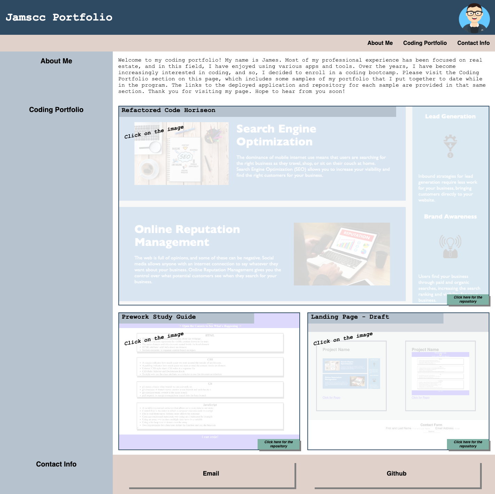

# Jamscc Portfolio (Web Application)

## Description

Users can access this web application to find information about Jamscc and selected samples of Jamscc's Coding Portfolio. There is a contact section that users can use to email Jamscc and/or access the GitHub repositories. Users can also access the underlying codebase for this web application (see Links and Usage below). The flow and structure can be understood via the various semantic elements that were added to the HTML. In an effort to provide a more responsive layout, flexbox and media queries were used (see CSS file). The CSS file also includes CSS variables.

## Links and Usage 

To access the deployed application, please visit: https://jamscc.github.io/web-app-jamscc-portfolio/

Users can access the codebase in Chrome by navigating to Chrome DevTools. The codebase can also be accessed via the following link:

https://github.com/jamscc/web-app-jamscc-portfolio

## Screenshot

The following is the screenshot for the web application:

